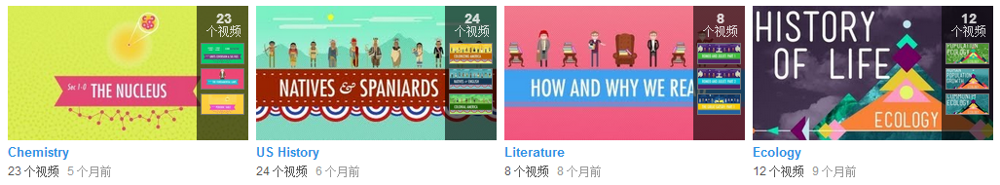

#### Crash Course 是 Youtube 的一个频道.   
https://www.youtube.com/channel/UCX6b17PVsYBQ0ip5gyeme-Q

  
  

#### 目前有化学, 美国历史, 文学, 生态学, 生物学, 世界历史  
当前正在更新的系列是__化学__和__美国历史__  
化学由 Hank Green 负责  
美国历史由 John Green 负责  
 
 
### 化学的进度(正在更新, 目前有23集)
[@糖醋陈皮]和[@Ruki-n-]正在跟进.  
视频列表:  
https://github.com/1c7/VideoList

 
### 美国历史的进度(正在更新, 目前有24集)  
新浪公开课已经翻译了8集:  
http://open.sina.com.cn/course/id_817  

 
### 文学的进度(共8集)
目前没人翻译.. 有兴趣的同学可以去翻这个系列..

 
### 生态学的进度(共12集)
已经翻译了前5集  
视频列表:  
https://github.com/1c7/VideoList

 
### 生物学的进度(共40集)
已经翻译了39集, 没翻译的那集是第24集  
视频列表:  
https://github.com/1c7/VideoList

 
### 世界历史的进度(共42集)
新浪公开课已经把全部42集翻译完了.  
http://open.sina.com.cn/course/id_465

 
 
 

<!--

 
### 正在翻译Crash Course的译者名单:

-->