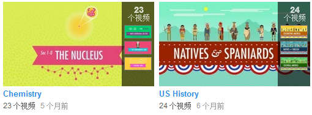
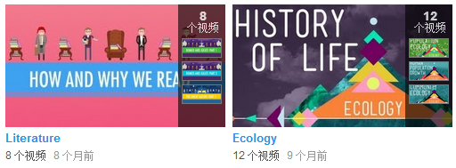
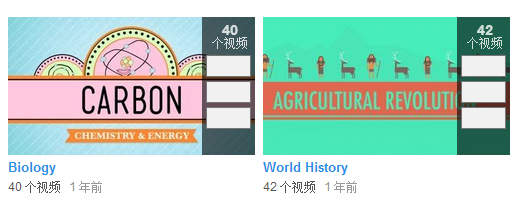

#### Crash Course 是一个 Youtube 频道: https://www.youtube.com/channel/UCX6b17PVsYBQ0ip5gyeme-Q

  
  
  

 
#### 世界历史的进度(共42集)
新浪公开课已经把全部42集翻译完了  
http://open.sina.com.cn/course/id_465

 
#### 美国历史的进度 (官方正在更新的系列)  
新浪公开课已经翻了前8集:  
http://open.sina.com.cn/course/id_817  

 
#### 文学的进度(共8集)
新浪公开课正在翻译:  
http://open.sina.com.cn/course/id_887/#887#open  

 
#### 生态学的进度(共12集)
我正在和网易公开课合作翻译校对  

 
#### 生物学的进度(共40集)
我正在和网易公开课合作翻译校对  

 
#### 化学的进度 (官方正在更新的系列)
[@糖醋陈皮](http://www.weibo.com/u/2004104451?wvr=5&) 和 [@Ruki-n-](http://www.weibo.com/518485675)正在跟进  
视频列表:  
https://github.com/1c7/VideoList

 
 
如果你对 Crash Course 的视频有兴趣, 想参与翻译或校对  
可以加群: 329514387  
:D  
