### 这里是一篇翻译视频的教程  
写于2013年8月5日  

 
#### 1. 我想去Youtube找有趣的视频, 可是上不去, 怎么翻墙? 
关键词: goagent  
相关的教程网上有很多了, 这里不再赘述  

 
#### 2. 我在Youtube上找到了有趣的视频, 视频怎么下载? 
[Tampermonkey - YouTube Video Download](http://userscripts.org/scripts/show/62634)  
安装完这个 Tampermonkey 脚本后.  每个Youtube视频下面都会有下载按钮  
(建议下720p的视频, 具体原因后面会说)   
预览图:  
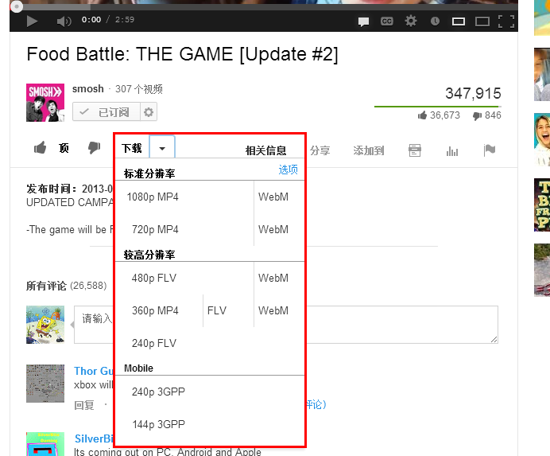  
这个脚本的汉化有点问题, __标准分辨率__和__较高分辨率__写反了..  

 
#### 3. 视频是下载好了, 字幕怎么办?, Youtube视频的字幕怎么下载?

[Tampermonkey - Youtube Subtitle Downloader](http://userscripts.org/scripts/show/170867)   
这个Tampermonkey脚本可以下载[做好的字幕], 安装后每个视频下都会有下载按钮.  __推荐!__  
预览图(没有字幕的视频):  
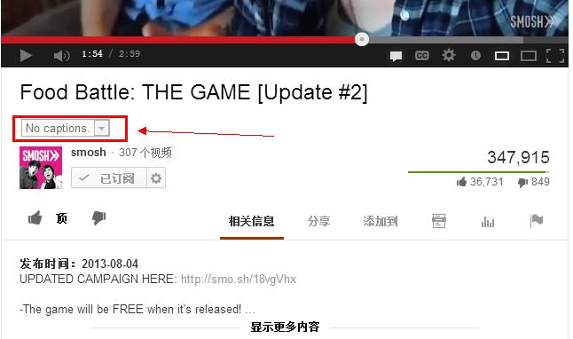  
预览图(有字幕的视频):  
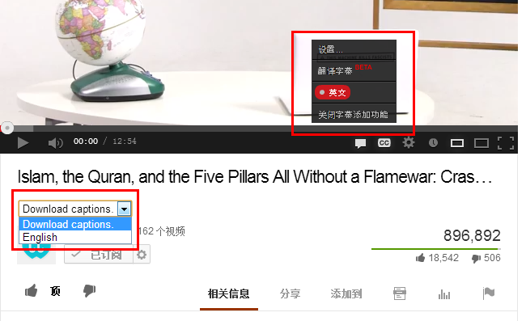  

额外说明: 这个脚本由Tim Smart编写, 我改进了一下..  
(Tim Smart的原版不能直接下载, 字幕内容会在新标签页面里打开, 需要用户手动黏贴到新文件里, 现在可以直接下载了)       

 
 
 
[Tampermonkey - Youtube Auto Subtitle Downloader](http://userscripts.org/scripts/show/168581)    
这个Tempermonkey脚本可以下载[自动字幕], 安装后每个视频下也会有下载按钮.  __推荐!__  
预览图(有自动字幕的视频):  
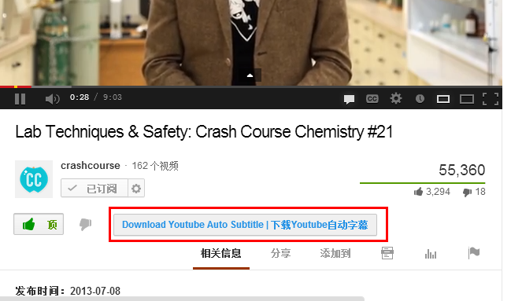 

额外说明: 这个脚本是我写的. 如果有bug就找我吐槽吧..  

 
#### 3.1 上面那3个脚本都安装好后会咋样?
这样:   
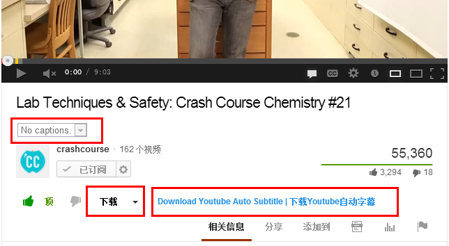  

 
#### 3.2 只能用脚本下视频吗? 有没有网站提供下载字幕功能?
__这个可以有!__  
http://www.yousub.net/    
但这个网站只能下载[做好的字幕], 不能下载[自动字幕]  
而且也不怎么方便..  不建议使用  

 
#### 4. 视频和字幕我都下载好了, 我需要什么软件来翻译视频?  
你需要[翻译字幕的软件], [压制视频的软件], 以及[转换字幕文件格式的软件]...  
这3样是最常用的  

1. [Aegisub](http://www.aegisub.org/)  只能用于翻译字幕, 不负责压制工作  
2. [小丸工具箱](http://maruko.appinn.me/) 很好用的压制工具  
3. [SrtEdit](http://www.baidu.com/s?wd=srtedit) 用于转换字幕文件的格式 (我一般用它把srt转换成ass, 或是ass转srt)   

#### 5. 嗯, 3样我都安装好了, 接下来呢?
1. 打开Aegisub  
  

2. 拖入视频  
  
(上面是正在读取)  
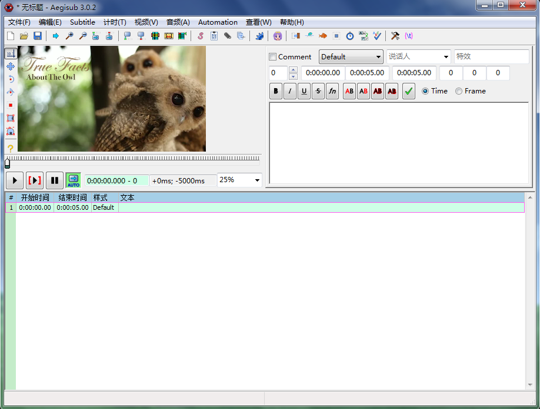  
(上面是读取完毕)  

3. 拖入字幕  
拖入字幕这里要额外说明一下, Aegisub对SRT格式字幕的支持不是很好,   
有时所有字幕会缩成一行, 如果缩成了一行, 那你就把字幕文件拖入SrtEdit, 转换成ASS格式就行了..  
字幕拖入之后是这样的:  
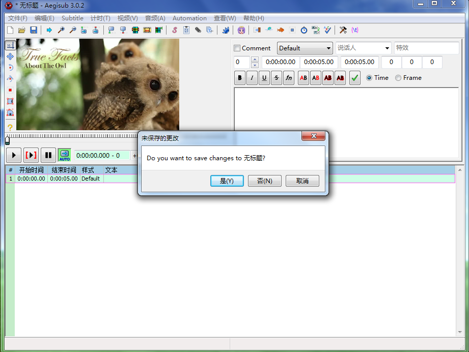  
(不用鸟它, 点"否"就行, 这个"无标题"指的是当前这个下方这块的空字幕..)  
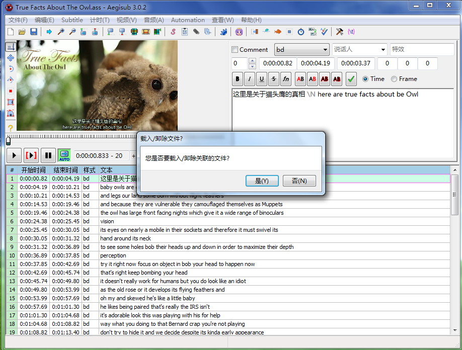   
(也不用理它, 同样点"否")  
  
(现在可以了, 开始编辑吧)  

 
#### 6. 为什么放视频的时候没声音(怨念状)?
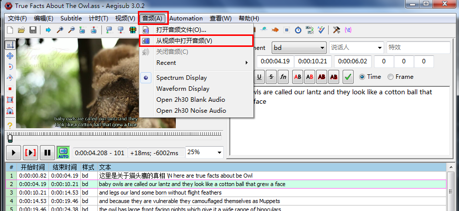   
点击【音频】 -> 【从视频中打开音频】  
现在可以了.. 有声音了..  
   

 
#### 7. 视频太小了!!..敢不敢放大一点?!!!
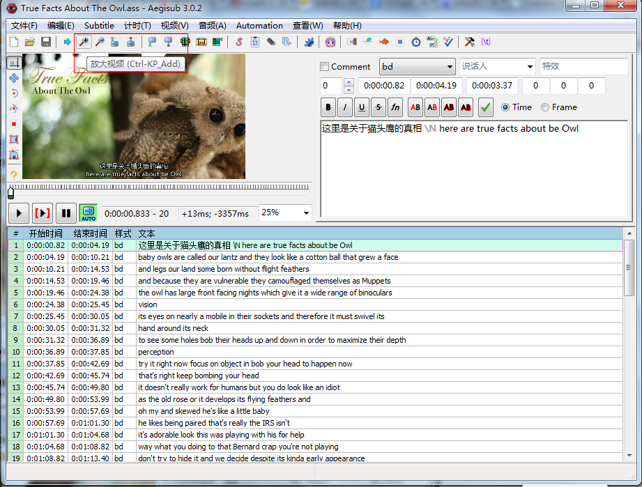   
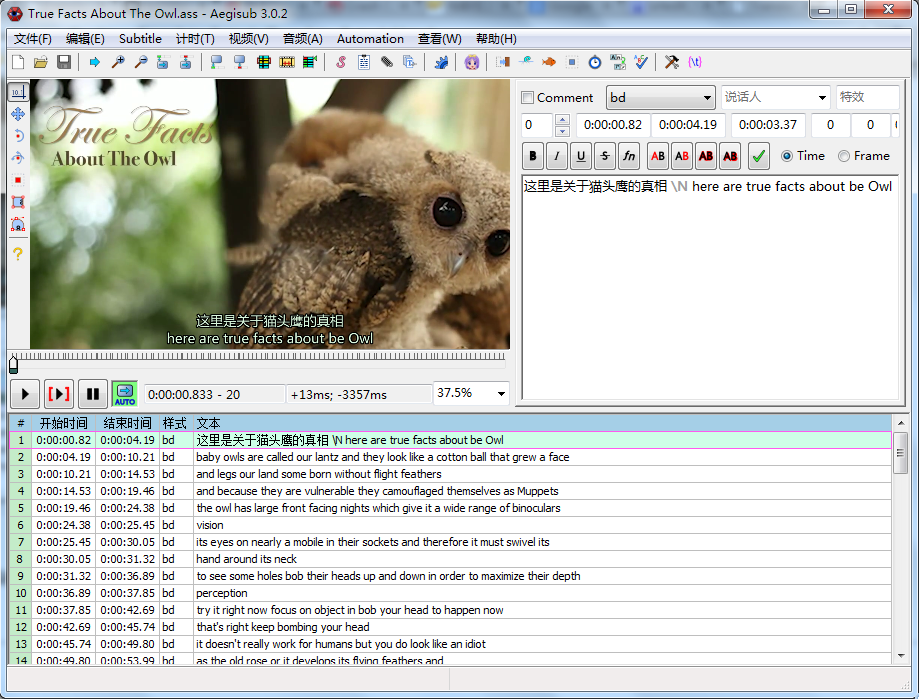   

 
#### 8. 我想弄成中文字幕在上面 英文字幕在下面 应该怎么写?
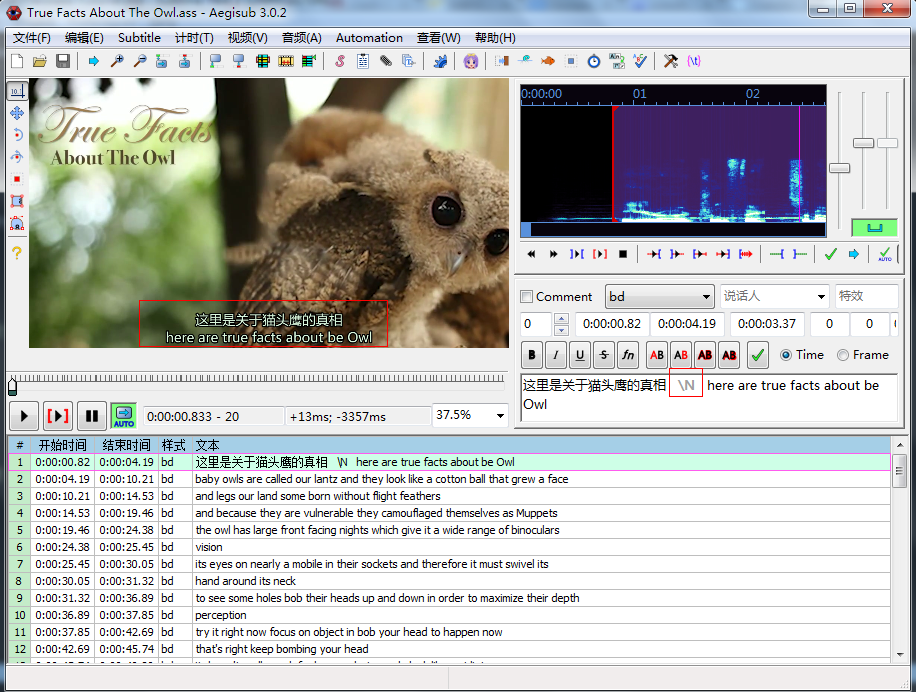   
中间加个\N  

 
#### 9. 我的字幕翻译好了, 视频要怎么压制?

1. 打开小丸工具箱  
  

2. 点击"视频"标签页  
  

3. 拖入视频文件和字幕文件  
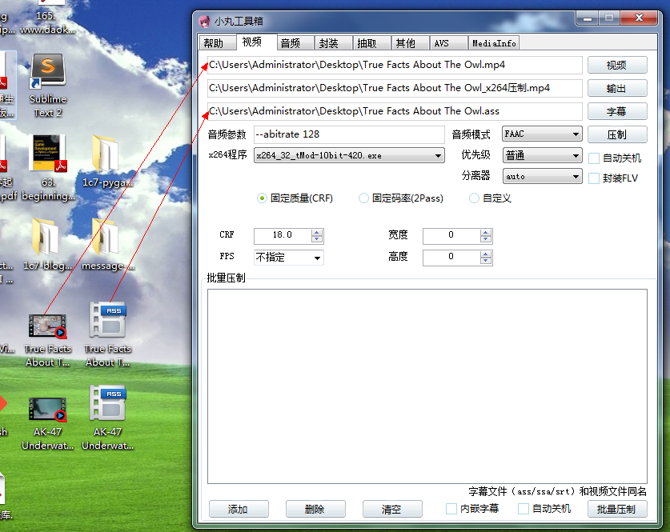  
("输出"按钮代表输出的路径和输出的文件名.... 不是压制视频的意思)  

4. 点击"压制"按钮  
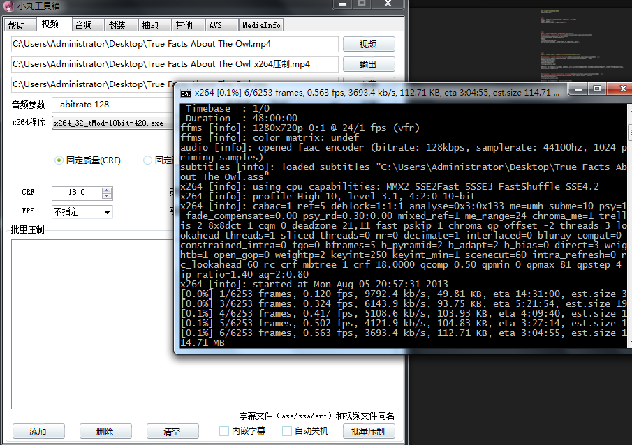  

5. 等!  
  

6. 压制好之后你爱扔哪儿扔哪儿吧....

 
 
### 没了...教程写完了...

 
 

---

 
 

## 番外篇:

#### 一些解释

 
问: 什么是Tampermonkey?  
答: 是Chrome的一个扩展, 可以用它方便的写出脚本, 而且它们还提供了一个很方便的平台可以发布和分享脚本..  

 
问: 什么是自动字幕?  
答: Youtube有语音识别技术, 可以自动给视频加英文字幕, 准确率挺可观的 正确率平均可以达到80%以上   
我之所以自己写下载自动字幕的脚本(见上面的说明), 是因为网上找不到这样的工具....  

 
#### 常见问题1: 英文字幕里老是有黏在一起的词啊!!!! areyou啊! whatis啊! 每次都要在中间打个空格啊!!! 打多了烦啊!!! 

https://github.com/1c7/Split-StickWord   
用这个脚本吧   把字幕文件拖放到 exe/Split_Word.exe 上面即可  
程序会根据 split.txt 里面的分割词来分词...  

 
#### 常见问题2: 英文太差, 有没有工具可以把字幕文件用谷歌翻译翻译一遍啊? 翻译完了我再修改... 

https://github.com/1c7/Translate-Subtitle   
把字幕文件拖放到 English-Chinese/Translate_Subtitle.exe 上面即可(支持srt和ass格式, 其他的格式还没测试过)  
程序会用谷歌翻译翻译字幕的...   
翻译完成后字幕会保存到新文件里..   
假设原文件名是: test.srt  
新文件名会是: (翻译完成)test.srt  

 
#### 我想给视频加入黑边, 把字幕放在黑边里, 咋办!!!!!!  
我去睡觉了..下次接着写

 
 
 
 
 
 