### 翻视频教程  
(最后更新时间: 2014年9月13日)    

 
#### 1. 怎么翻墙?
关键词: goagent/VPN  
相关教程网上很多, 不赘述  

 
#### 2. 怎么下 Youtube 视频?
把地址里的 youtube 改成 ssyoutube  

例子：
https://www.youtube.com/watch?v=jWgcVHoUqS4 

https://www.ssyoutube.com/watch?v=jWgcVHoUqS4 

 
#### 3. 怎么下 Youtube 字幕?

http://www.zhihu.com/question/19647719/answer/16843974?group_id=789328566

 
#### 4 只能用脚本下视频吗? 有没有网站提供下载字幕功能?
__这个可以有!__  
http://www.yousub.net/    
但这个网站只能下载[做好的字幕], 不能下载[自动字幕]  
而且也不怎么方便..  不建议使用  

 
#### 5. 视频和字幕我都下载好了, 我需要什么软件来翻译视频?  
你需要[翻译字幕的软件], [压制视频的软件], 以及[转换字幕文件格式的软件]...  
这3样是最常用的  

1. [Aegisub](http://www.aegisub.org/)  只能用于翻译字幕, 不负责压制工作  
2. [小丸工具箱](http://maruko.appinn.me/) 很好用的压制工具  
3. [SrtEdit](http://www.baidu.com/s?wd=srtedit) 用于转换字幕文件的格式 (我一般用它把srt转换成ass, 或是ass转srt)   

 
#### 6. 嗯, 3样我都安装好了, 接下来呢?
1. 打开Aegisub  
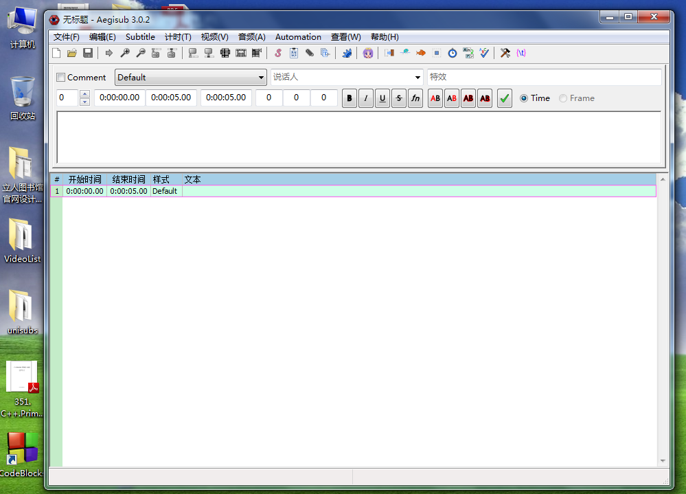  

2. 拖入视频  
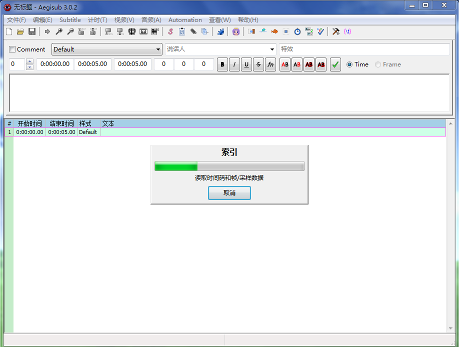  
(上面是正在读取)  
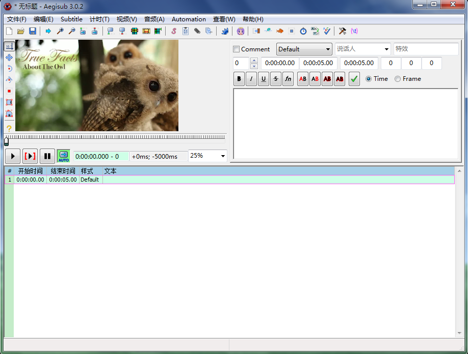  
(上面是读取完毕)  

3. 拖入字幕  
拖入字幕这里要额外说明一下, Aegisub对SRT格式字幕的支持不是很好,   
有时所有字幕会缩成一行, 如果缩成了一行, 那你就把字幕文件拖入SrtEdit, 转换成ASS格式就行了..  
字幕拖入之后是这样的:  
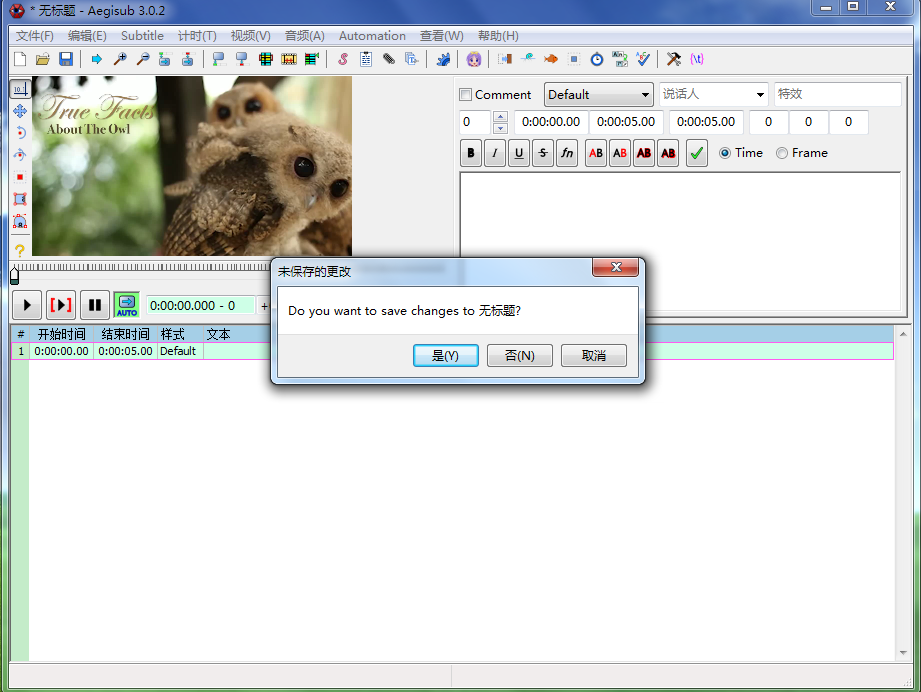  
(不用鸟它, 点"否"就行, 这个"无标题"指的是当前这个下方这块的空字幕..)  
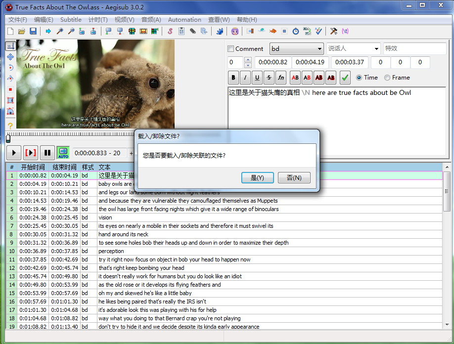   
(也不用理它, 同样点"否")  
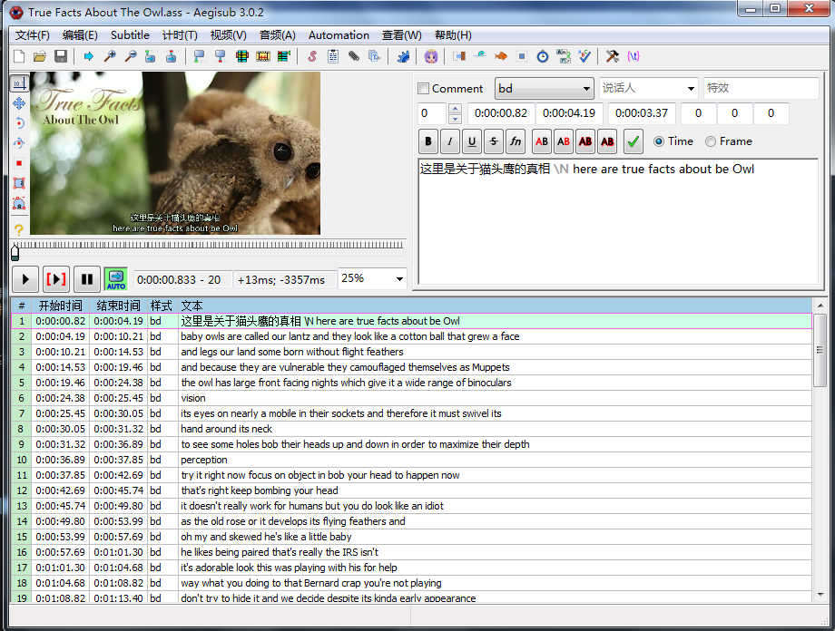  
(现在可以了, 开始编辑吧)  

 
#### 7. 为什么放视频的时候没声音?
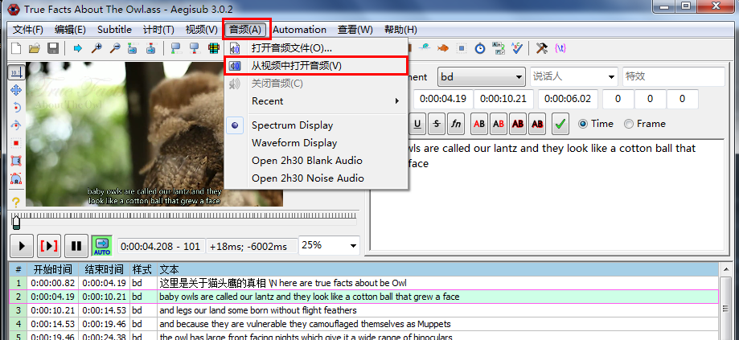   
点击【音频】 -> 【从视频中打开音频】  
现在可以了.. 有声音了..  
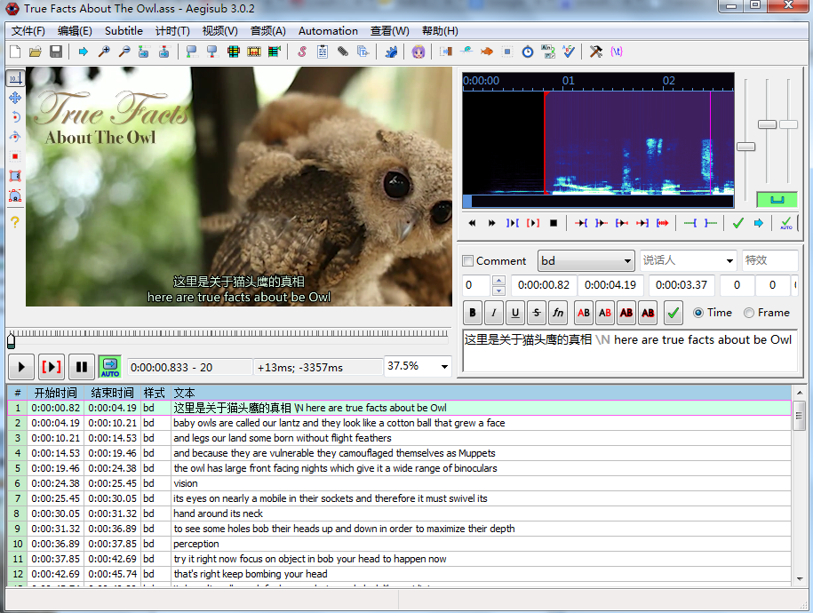   

 
#### 8. 视频太小了!!..敢不敢放大一点?!!!
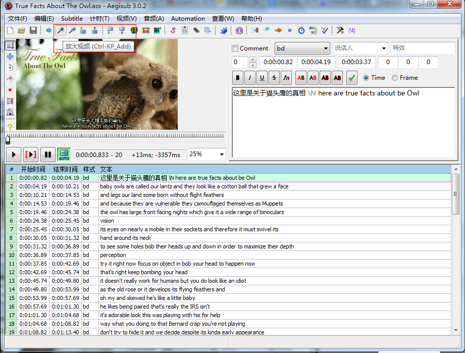   
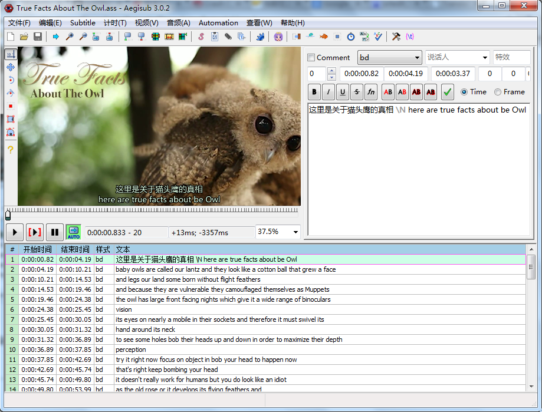   

 
#### 9. 我想弄成中文字幕在上面 英文字幕在下面 应该怎么写?
   
中间加个\N  

 
#### 10. 字幕翻译好了, 视频要怎么压制?

1. 打开小丸工具箱  
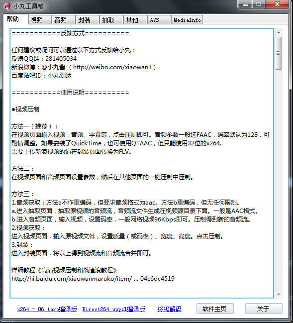  

2. 点击"视频"标签页  
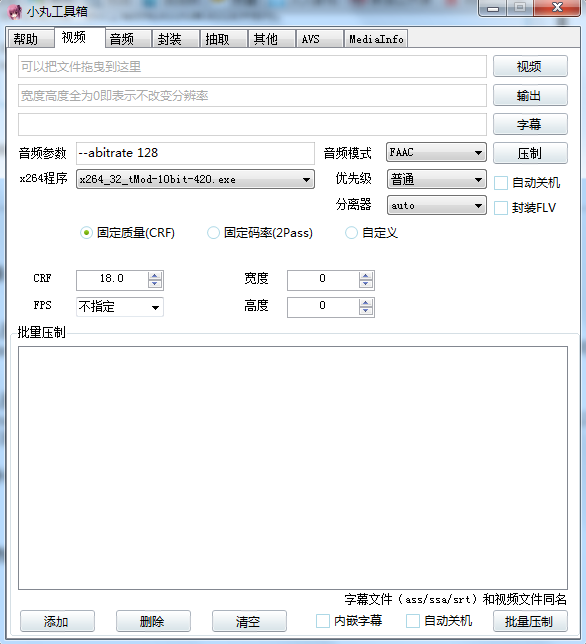  

3. 拖入视频文件和字幕文件  
  
("输出"按钮代表输出的路径和输出的文件名.... 不是压制视频的意思)  

4. 点击"压制"按钮  
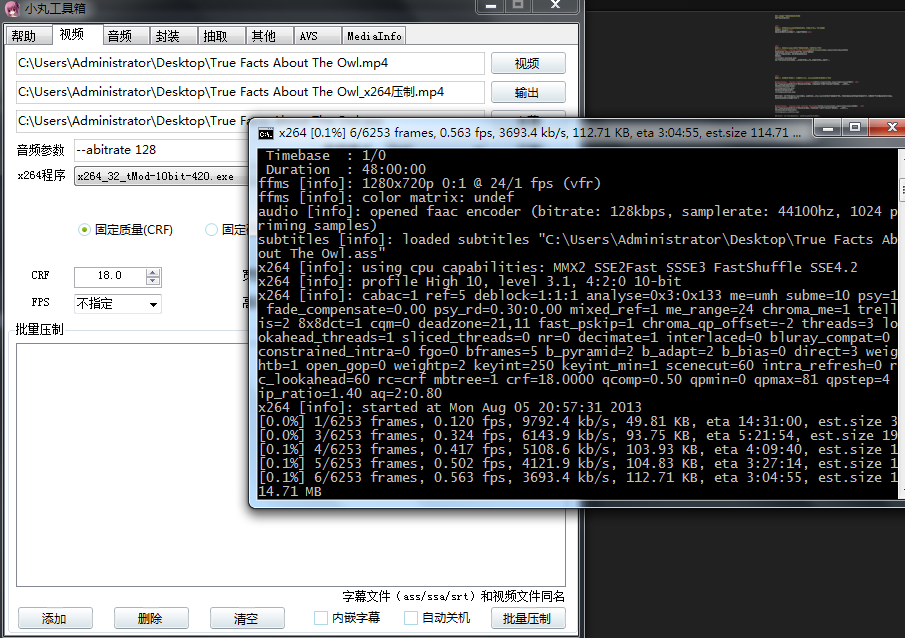  

5. 等!  
  

6. 压制好之后你爱扔哪儿扔哪儿吧....

 
 
### 没了...教程写完了...

 
 

---

 
 

### 一些解释:

 
问: 什么是Tampermonkey?  
答: 是Chrome的一个扩展, 可以用它方便的写出脚本, 而且它们还提供了一个很方便的平台可以发布和分享脚本..  

 
问: 什么是自动字幕?  
答: Youtube有语音识别技术, 可以自动给视频加英文字幕, 准确率挺可观的 正确率平均可以达到80%以上   
我之所以自己写下载自动字幕的脚本(见上面的说明), 是因为网上找不到这样的工具....  

 
### 我想给视频加入黑边, 把字幕放在黑边里, 咋办?
如果你下载的视频是720p的(1280x720), 它是16:9的比例.
你可以把它压制成4:3的(1280x960).

1. 打开小丸工具箱, 点击AVS标签页  
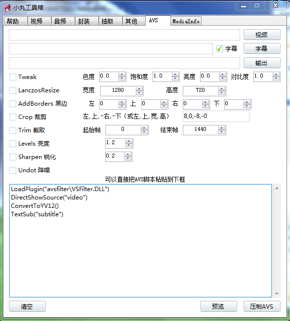  

2. 拖入视频和字幕  
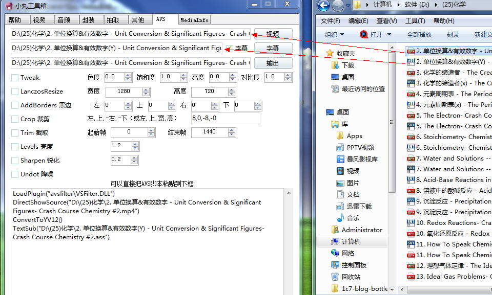  

3. 勾选"黑边", 上120, 下120  
  

4. 点击"预览".  
  
   
(对字体大小不满意的话在Aegisub里修改就行...)  

5. 满意后点击"压制AVS"  
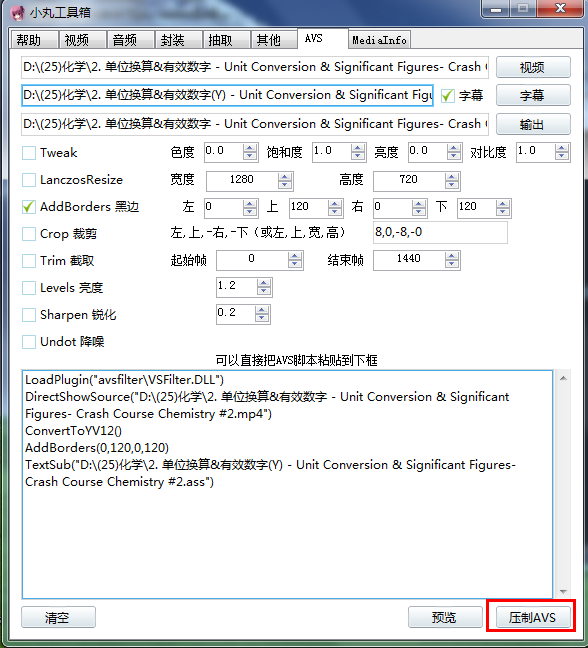  
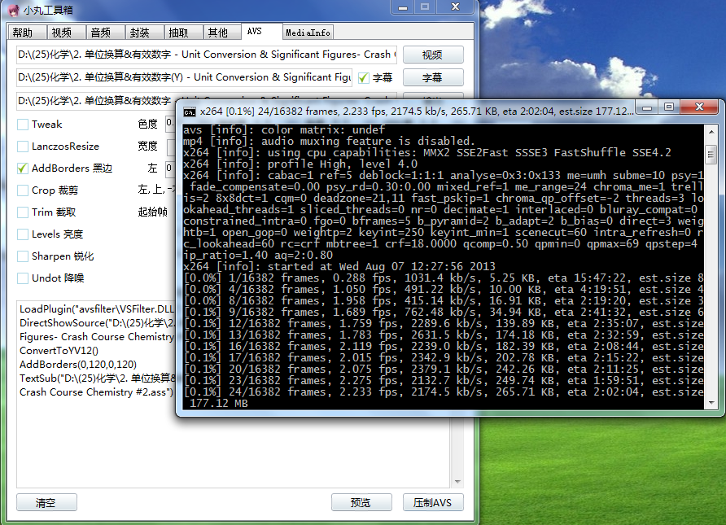  
__(小贴士: 如果你不想加黑边 只想在"视频"标签页里压制视频, 也可以先来"AVS"标签页这里预览一下, 预览完了再去"视频"标签页压视频. )__

 
 
### AVS压制视频没声音的解决方法: 
我的机子是windows7 x64位, 用"AVS"压制后 输出的视频文件会没有声音  
如果你也碰到这种情况, 解决方法:  

1. 进入"抽取"标签页  
  

2. 点击"视频"按钮, 会弹出一个文件选择框, 选择有声音的那个原视频文件..  
   
注意, 必须用按钮方式选, 直接拖入文件会无法抽取音频...  
这应该是某种bug吧..  

3. 点击"抽取音频1"  
  
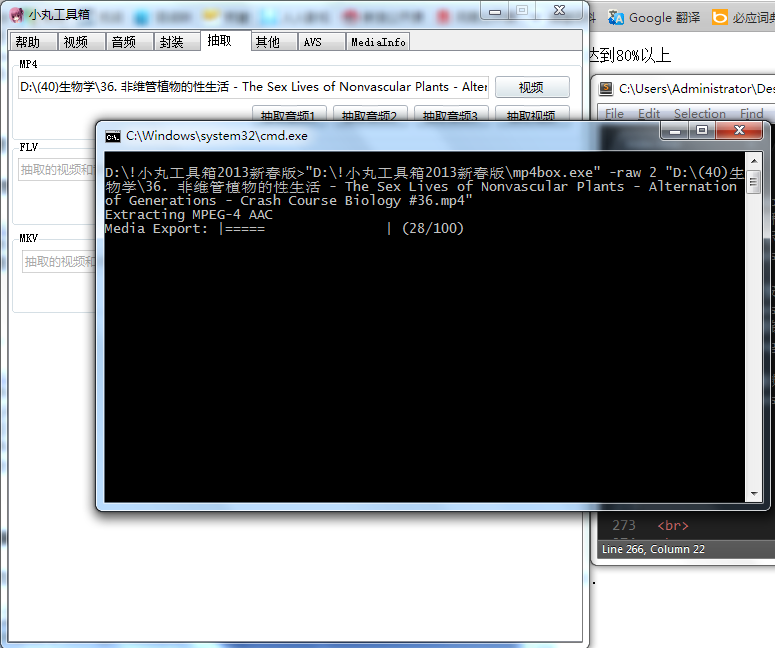  

4. 进入"封装"标签页  
把[没声音但是有字幕的视频文件], 和[音频文件]拖入对应的地方  
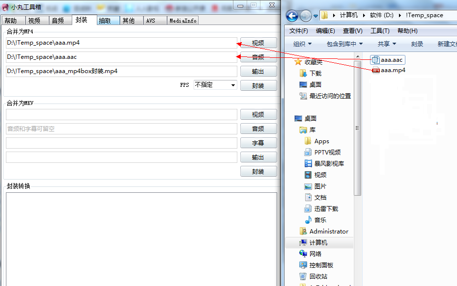   
然后点击"封装"即可  
  
(不要在意这里的文件名, 我是随便拿个文件来演示而已....)  

 
 
 
 
 
 
