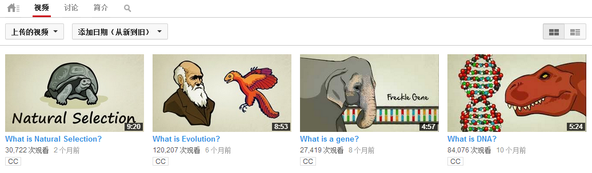

 
#### 十分钟生物学 - Crash Course Biology (共40集)
我们翻完后放网易公开课上去了, 地址:  
http://v.163.com/special/opencourse/crashcoursebiology.html  

 
#### 十分钟生态学 - Crash Course Ecology (共12集)
[1. 地球历史](http://video.sina.com.cn/v/b/121079106-2004104451.html)       
[2. 种群生态学](http://video.sina.com.cn/v/b/121080656-2004104451.html)    
[4. 群落生态学](http://video.sina.com.cn/v/b/121617295-2004104451.html)    
[5. 群落生态学2](http://video.sina.com.cn/v/b/121617497-2004104451.html)    
[6. 生态演替](http://video.sina.com.cn/v/b/121616256-2004104451.html)    
[7. 生态系统生态学](http://v.youku.com/v_show/id_XNjIxNjk2NjA4.html)    
[8. 水循环和碳循环-永恒的循环1](http://video.sina.com.cn/v/b/121617855-2004104451.html)    
[11. 污染](http://v.youku.com/v_show/id_XNjIwODg4NDY0.html)    
[12. 保护和恢复生态](http://v.youku.com/v_show/id_XNjIwODkxOTcy.html)    

参与翻译的人员：   
[@戴禄霍(新浪微博主頁)](http://weibo.com/738234769)  
[@洋流范儿(新浪微博主頁)](http://www.weibo.com/shanmusunny)   
[@糖醋陳皮(新浪微博主頁)](http://www.weibo.com/2004104451/profile?rightmod=1&wvr=5&mod=personnumber)

 
#### 十分钟化学 - 化学速成班 - Crash Course Chemistry (共46集)
[1. 原子核 ](http://v.youku.com/v_show/id_XNjExOTk3MTMy.html)  
[2. 單位轉換與有效位數 ](http://v.youku.com/v_show/id_XNjEyMDA3Nzcy.html)  
[3. 基本定律 ](http://v.youku.com/v_show/id_XNjEyMDEwMDk2.html)  
[4. 元素週期表 ](http://v.youku.com/v_show/id_XNjEyMDEyNDky.html)  
[5. 電子 ](http://video.sina.com.cn/v/b/116716605-2004104451.html)  
[21. 实验室安全 - Lab Techniques & Safety - Crash Course Chemistry #21](http://www.weibo.com/2076100713/A3ndJ7bPH?mod=weibotime)

参与翻译的人员有：  
[班尼張(Facebook主頁)](https://www.facebook.com/BennySciCh?fref=ts)  
[@Ruki一n一(新浪微博主頁)](http://www.weibo.com/518485675?topnav=1&wvr=5&topsug=1)   
[@糖醋陳皮(新浪微博主頁)](http://www.weibo.com/2004104451/profile?rightmod=1&wvr=5&mod=personnumber)

 
#### Stated Clearly
原地址: http://www.youtube.com/user/sciencestatedclearly/videos   
   
* [什么是DNA? - What is DNA?](http://v.youku.com/v_show/id_XNTY2NzA4MTI4.html)
* [什么是基因? - What is a gene?](http://v.youku.com/v_show/id_XNTY2NTA5NDMy.html)
* [什么是进化? - What is Evolution?](http://v.youku.com/v_show/id_XNTg5MzQ1ODI0.html)
* [什么是自然选择? - What is Natural Selection?](http://v.youku.com/v_show/id_XNTkyMDUwMzgw.html)

 
#### 太空
这部分的来源比较杂.  
但主要来自加拿大航天局(canadianspaceagency): http://www.youtube.com/channel/UCdNtqpHlU1pCaVy2wlzxHKQ 

* [(加拿大航天局) 在太空里怎么刷牙?](http://v.youku.com/v_show/id_XNTcwMzUwMDk2.html)
* [克里斯·哈德菲尔德和流言终结者-测试新的太空食谱](http://www.weibo.com/2004104451/zz8eMkhDQ)
* [(TED-ed) 宇航员的生活](http://www.weibo.com/2004104451/ztboXsKef)
* [(SciShow) 太空垃圾-下一个大困境](http://www.weibo.com/2004104451/zsiaxtWXs)
* [(加拿大航天局) 克里斯·哈德菲尔德教你如何控制国际空间站的机械臂](http://www.weibo.com/2004104451/zuSN1FyPS)
* [(加拿大航天局) 国际空间站上的甜点](http://www.weibo.com/2004104451/zuAFs2pPe)
* [(加拿大航天局) 在太空里怎么剪头发?](http://www.weibo.com/2004104451/zsgMCl6kp)
* [(加拿大航天局) 在太空里怎么睡觉? ](http://www.weibo.com/2004104451/zsgJT3dod)
* [(加拿大航天局) 在太空里怎么锻炼?](http://www.weibo.com/2004104451/zsqZamf4N)  
* [(加拿大航天局) 国际空间站如何将水回收利用?](http://www.weibo.com/2004104451/zu6jZw37d)
* [(加拿大航天局) 在国际空间站上想吐怎么办?](http://www.weibo.com/2004104451/zwe6U8iJ3)
* [(加拿大航天局) 宇航员哼着歌玩空间站上的过期防烟面具 -- Quick-Don Mask- Work can be Fun](http://www.weibo.com/2004104451/zwe35pyC2)  
* [如何成为你想成为的人? - 宇航员克里斯·哈德菲尔德](http://www.weibo.com/2004104451/zvWdtsgh1)  
* [宇航员离心机训练 - 宇航员克里斯·哈德菲尔德](http://v.youku.com/v_show/id_XNTc2MTU3MTM2.html)  
* [游览国际空间站 - 命运号实验舱 & 哥伦布实验舱 & 希望号实验舱](http://www.weibo.com/2004104451/zwOkbj39w)     
* [游览国际空间站- 和谐号节点舱 & 宁静号节点舱 & 团结号节点舱](http://v.youku.com/v_show/id_XNTc2MTA1ODQ4.html)

 
#### 太空音乐 & 其他
* [国际空间站里玩长笛二重奏 - 伊恩·安德森,卡迪·科尔曼](http://www.weibo.com/2004104451/zDvkww9CF?mod=weibotime)  
* [我们皆是探索者 - We Are the Explorers](http://www.weibo.com/2004104451/zxChl3fKF)
* [What Kind of World Do You Want | Youtube-ReelNASA](http://www.weibo.com/2004104451/zwecABl2K)
* [Life on the International Space Station](http://www.weibo.com/2004104451/zwed4bZMD)
* [NASA - 地球夜景](http://v.youku.com/v_show/id_XNTcwMjY2MTMy.html)
* [Space Oddity - 宇航员克里斯·哈德菲尔德](http://www.weibo.com/2004104451/zxSv9FSj1)
* [Chris Hadfield 和数百名学生一起唱 "Is Somebody Sing"](http://www.weibo.com/2004104451/zBOWxEmQD)
* [(英文字幕) Chris Hadfield and Barenaked Ladies I.S.S (Is Somebody Sing)](http://www.weibo.com/2004104451/zBOWRsq2T)

 
#### 斯潘格勒实验秀 - The Spangler Effect
来源: http://www.youtube.com/channel/UC6sWKVFVfuyTk0FTPY4c62Q

* [斯潘格勒实验秀(第1季第11集) -- 烧钱 [12:43]](http://www.weibo.com/2004104451/zwEEABkXt)  
* [斯潘格勒实验秀(第2季第12集) -- 自制冰淇淋  [17:17]](http://v.youku.com/v_show/id_XNTc2OTA5ODQ4.html)  

 
#### 科学短片
* [关于树的奇妙事 - Veritasium](http://video.sina.com.cn/v/b/122247000-2004104451.html)
* [(MinuteEarth) 我们的大气层正在散逸! --Our Atmosphere is Escaping!](http://www.weibo.com/2004104451/zxiXK52YE)
* [(MinuteEarth) 山到底能有多高?](http://www.weibo.com/2004104451/zszIXzkFb)
* [(MinuteEarth) 为什么地球上会有沙漠? ](http://www.weibo.com/2004104451/zshAmoAU8)
* [(MinuteEarth) 冷冻食物的故事](http://www.weibo.com/2004104451/zvXm3oUTu)
* [为什么要使用卫星来测量降雨量? ](http://www.weibo.com/2004104451/zsh4UavQe)
* [Pi和苹果派 - Calculating Pi with Real Pies - Numberphile](http://weibo.com/2004104451/zvsmx0ACo)
* [染色体的结构 - How DNA is Packaged (Advanced)](http://www.weibo.com/2004104451/zDvSljd5T?mod=weibotime)  

 
#### 搬运系列(字幕来源网络,非本人翻译)
来源TED-ed:   
http://ed.ted.com/   
http://www.youtube.com/channel/UCsooa4yRKGN_zEE8iknghZA  

* [鱼的自述: 我曾是浮游生物的秘密生活](http://video.sina.com.cn/v/b/110758524-2004104451.html)
* [原子对撞机是怎么工作的 | How does an atom-smashing](http://video.sina.com.cn/v/b/110759144-2004104451.html)
* [孟德尔的豆豆是怎么帮助我们理解遗传学的](http://video.sina.com.cn/v/b/110203875-2004104451.html)
* [光是粒子还是波? | Is light a particle or a wave?](http://v.youku.com/v_show/id_XNTg2NTc1MDI0.html)
* [为啥地球上会有风暴? | What on Earth is spin - Brian Jones](http://v.youku.com/v_show/id_XNTg3ODg3MjY4.html)
* [深海生物如何繁衍 | How life begins in the deep ocean](http://v.youku.com/v_show/id_XNTcwMzMwMDMy.html) 
* [颜色是什么?](http://www.weibo.com/2004104451/zt9dTdIVS) 
* [我们如何看到顏色?](http://www.weibo.com/2004104451/zqKTZuLhl)
* [什么是放射性?](http://www.weibo.com/2004104451/zszHeAPIJ)
* [癌细胞和健康细胞有什么不同?](http://www.weibo.com/2004104451/zszJh6nYU) 
* [为什么互相竞争的商店会开在一起?](http://www.weibo.com/2004104451/zpgjvFzu6)
* [为什么我们还找不到外星生命存在的证据呢?](http://www.weibo.com/2004104451/zqKUb2t3g)
* [微生物与你](http://www.weibo.com/2004104451/zszHRBRiK)
* [所有英雄的内在模式,英雄之旅](http://www.weibo.com/2004104451/zsqZMs7ZR)
* [洗澡如何启发了阿基米德发现浮力原理](http://www.weibo.com/2004104451/zqKTkqe5C)
* [亚里士多德 和 约夏·贝尔 教你如何劝说](http://www.weibo.com/2004104451/zszIgqIIl)
* [简单的理念如何带领科学发现 -- 流言终结者主持人: 亚当·萨维奇](http://www.weibo.com/2004104451/zsA5z7BIb) 

 
#### Smarter Every Day
视频来自Youtube的Smarter Every Day频道.  
地址是:   http://www.youtube.com/channel/UC6107grRI4m0o2-emgoDnAA

* [Smarter Every Day 53 - 会旋转的粘性液体](http://v.youku.com/v_show/id_XNDU5NTQwNDc2.html?f=18563154)   
* ( 上面这个视频是[煎蛋小学堂](http://www.weibo.com/jandanxxt?topnav=1&wvr=5&topsug=1)的, 翻译者是[JVINIC](http://www.weibo.com/jvinic?topnav=1&wvr=5&topsug=1), 在这里推荐一下. )  
* [Smarter Every Day 27 - 蜂鸟空气动力学](http://www.weibo.com/2004104451/zvl5tCWqO)
* [Smarter Every Day 42 - 为什么你出生的时候不会被淹死 - Why You Didn't Die at Birth](http://www.weibo.com/2004104451/zshZ9wNBF)
* [Smarter Every Day 62 - 鸟的翅膀是怎么工作的?](http://weibo.com/2004104451/zvsIqb4PE)
* [Smarter Every Day 85 - 他们在太空里回答我了!](http://www.weibo.com/2004104451/zsitC22Hq)
* [Smarter Every Day 86 - 13万帧每秒来拍摄鲁珀特之泪的神奇特性](http://www.weibo.com/2004104451/zBIgRyafa)
* [Smarter Every Day 87 - 高速录像解析蝙蝠的飞行原理](http://weibo.com/2004104451/zvslLpLsZ)
* [Smarter Every Day 45 - 直升机物理学1 - 介绍](http://www.weibo.com/2004104451/ztbsK77zr)
* [Smarter Every Day 46 - 直升机物理学2 -- 如何控制直升机?](http://weibo.com/2004104451/zvtAHwktt)
* [Smarter Every Day 92 - 怎么让蚂蚁扛着纸片 | How to get Ants to carry a sign](http://www.weibo.com/2004104451/zBx2QcqAb)
* [Smarter Every Day 94 - 奇妙的茧 | A MIND BLOWING Cocoon ](http://www.weibo.com/2004104451/zBx7b5ARp)
* [Smarter Every Day 95 - 高速录像拍摄AK47水下开枪(第1部分)](http://v.youku.com/v_show/id_XNTc2MTQyMDUy.html)

 
#### Crash Course 花絮
* [化学速成班花絮4 - 2014年01月20日](http://v.youku.com/v_show/id_XNjY1NzI1MTQ4.html)
* [Crash Course 美国历史花絮 - 2013/12/27](http://video.sina.com.cn/v/b/122922962-2004104451.html)
* [Crash Course 化学花絮 - 2013/12/02](http://video.sina.com.cn/v/b/121078812-2004104451.html)
* [Crash Course 化学花絮 - 2013/9/30](http://v.youku.com/v_show/id_XNjE1ODE2NTY4.html)
* [Crash Course 美国历史花絮 - 2013/08/02](http://video.sina.com.cn/v/b/111266570-2004104451.html)
* [Crash Course 美国历史&文学花絮 - 2013/05/31](http://www.weibo.com/2004104451/zze3KAn3N)
* [十分钟世界历史-花絮1](http://www.weibo.com/2004104451/zvUU5CuW6)
* [十分钟世界历史-花絮2](http://www.weibo.com/2004104451/zvUUbfykA)
* [十分钟世界历史-花絮3](http://www.weibo.com/2004104451/zvUURuW06)
* [十分钟生物学&生态学花絮集锦](http://www.weibo.com/2004104451/zvU9HCjYd)  

 
#### 其他杂类视频
* [超酷钢铁侠短片(跑车上穿戴盔甲)](http://v.youku.com/v_show/id_XNjY2NDUxNTgw.html)
* [Crash Course Psychology Preview](http://v.youku.com/v_show/id_XNjY3MDk1MDUy.html)
* [Elon Musk做客鸡毛秀](http://video.sina.com.cn/v/b/125027767-1835227073.html)
* [高清近距离拍摄 3部钢铁侠电影里的盔甲](http://www.weibo.com/2004104451/zxChgzOri)
* [加利福尼亚迪士尼, 钢铁侠3展览](http://www.weibo.com/2004104451/zu6fOnldK)
* [钢铁侠模拟游戏机](http://www.weibo.com/2004104451/zu5uLg9EU)  
* [复仇者幕后花絮](http://www.weibo.com/2004104451/zyVHue8kL)
* [对这个MV吐槽无力](http://www.weibo.com/2004104451/zyX3y7zEU)
* [菲利普 L 怀特 动物博物馆 - BrainScoop](http://v.youku.com/v_show/id_XNTc3NjYxNTEy.html)

 

---

 

### 关于这个列表的说明
这是个视频列表。目前的管理者是[@糖醋陈皮](http://www.weibo.com/u/2004104451?wvr=5&) 

有问题可以去我的微博(上面给了链接)给我留言, 或发私信.   
当然，如果你有Github帐号也可以直接开个issue  
 

