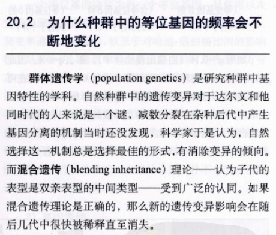  
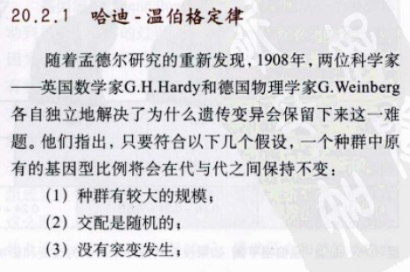  
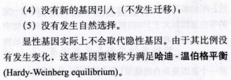   
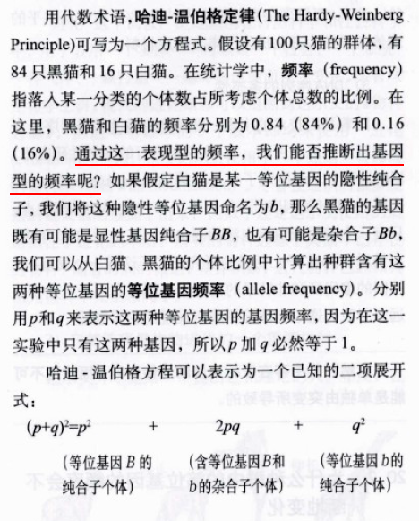   

 

---

 

#### 这公式有点难看清, 整理一下后是这样的:  
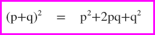   
 
 
#### 其实这就是个完全平方公式嘛..  
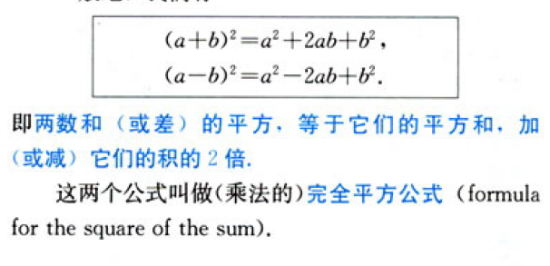   
### 维基把这种公式叫做[和平方](http://zh.wikipedia.org/wiki/%E5%92%8C%E5%B9%B3%E6%96%B9)  
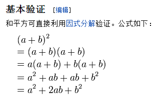   

 

---

 

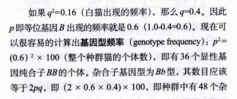   
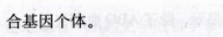   
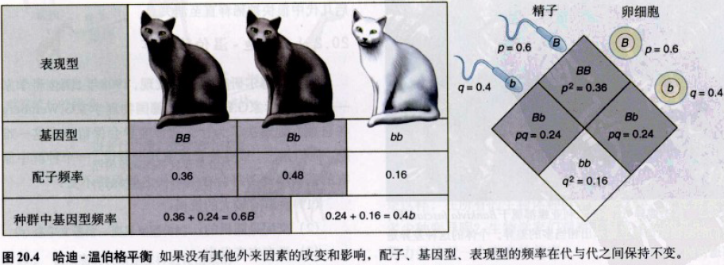   

 
## 资料来源: 
[《生物学》(第六版)](http://book.douban.com/subject/1328826/)  
第20章 种群中的基因 页数:电子书p442  实体书p405  

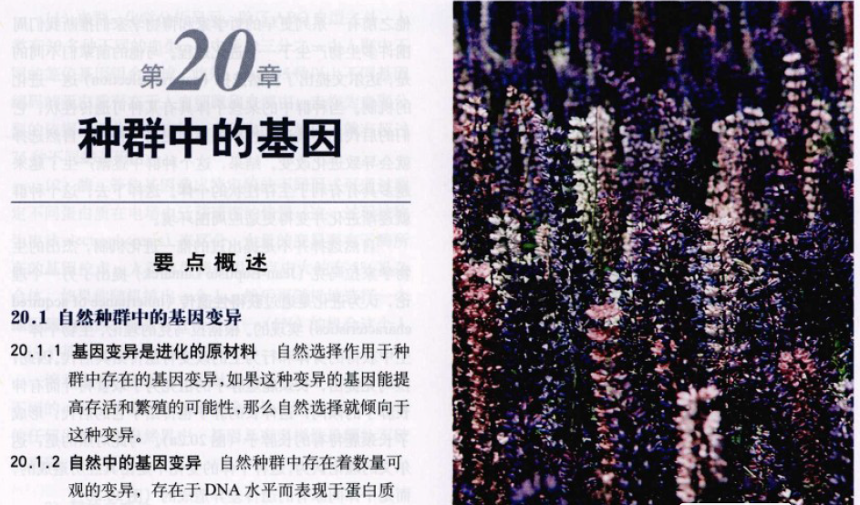   

